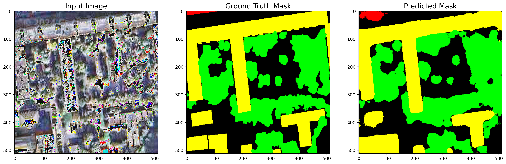
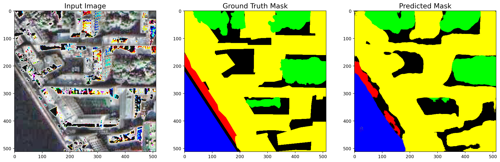
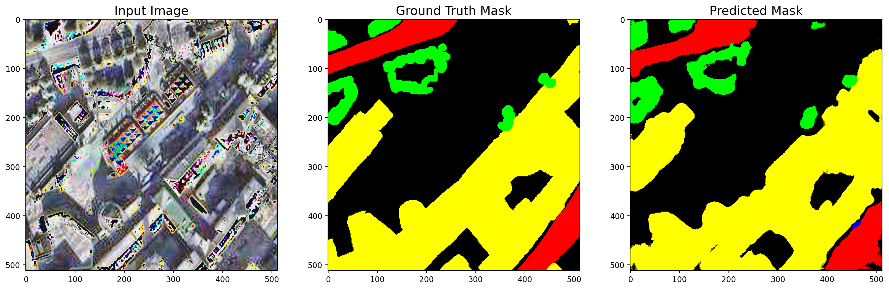
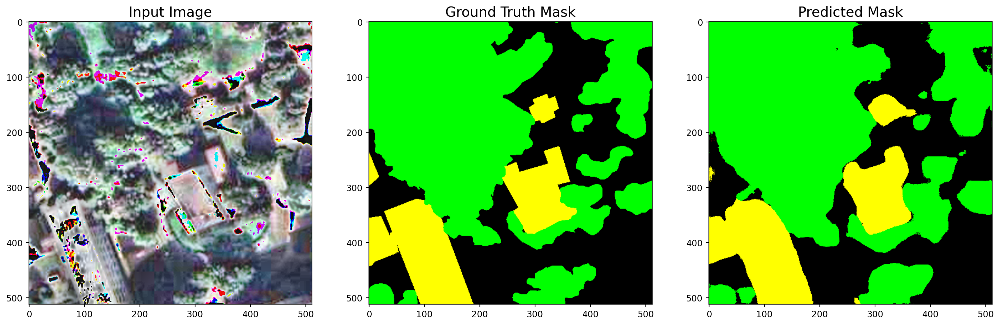
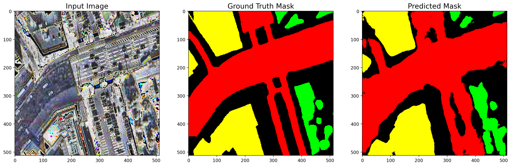
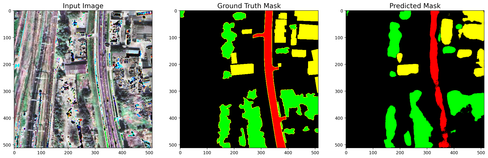
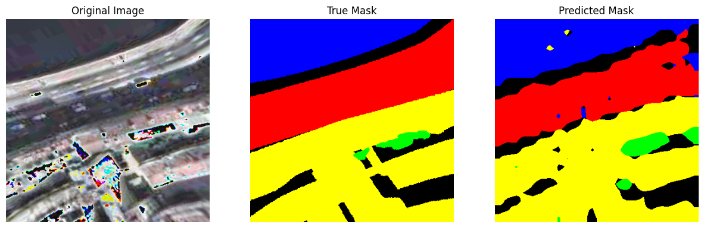
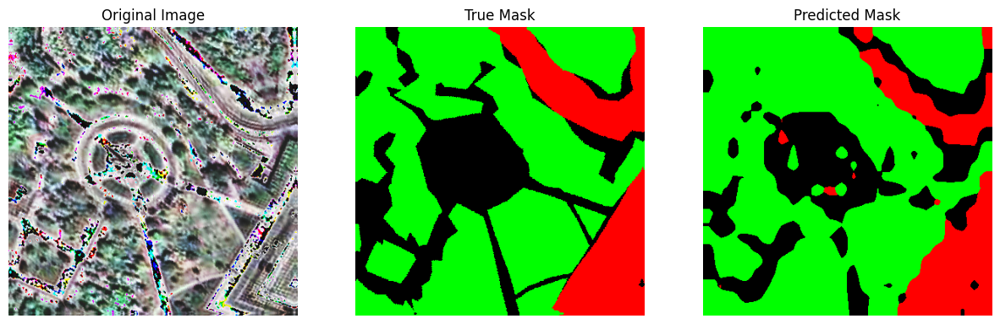
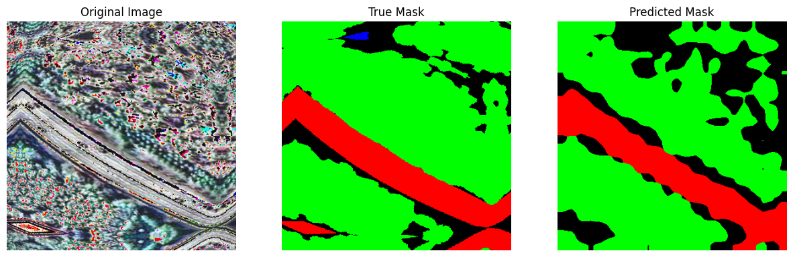
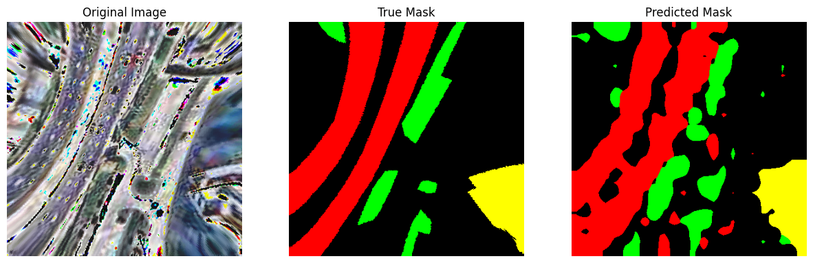

# InceptionResNetV2-Unet и VisionTransformer Large для сегментации изображений

Этот проект реализует модель InceptionResNetV2-Unet и VisionTransformer Large для задач сегментации изображений. Модель была обучена и проверена на собственном [датасете](https://www.kaggle.com/datasets/onergrand/russian-cities-satellite-photo-segmentation) с целью выполнения точной сегментации предоставленных изображений

В проекте есть две версии, первая - InceptionResNetV2-Unet, вторая - VisionTransformer Large, вторая модель была сделана из-за неудовлетворенности по метрикам первой модели, из-за чего была создана вторая версия с использованием другой архитектуры.
## Описание

Первая версия проекта - архитектура модели InceptionResNetV2-Unet. Архитектура модели объединяет возможности InceptionResNetV2 как экстрактора признаков с декодером в стиле U-Net для предсказаний на уровне пикселей. Код написан на Python с использованием библиотек для глубинного обучения TensorFlow/Keras.

Вторая версия проекта - архитектура модели VisionTransformer Large. Используемая модель была взята из timm и адаптирована для сегментации изображений. Код написан на Python с использованием библиотеки для глубинного обучения Pytorch.

## Результаты

По итогам первой версии проекта были получены следующие результаты:
- mean IoU = 0.4015, Dice Coefficient = 0.6700
- При таких посредственных показателях модель довольно хорошо отображала границы объектов, таких как здания и водоемы, однако она гораздо хуже работала с растительностью и дорогами, которые имеют не настолько точные границы

По итогам второй версии проекта были получены следующие результаты:
- mean IoU = 0.5445, Dice Coefficient = 0.6681
- При довольно значительном росте показателей модель показала что она хуже отображает четкие границы зданий и водоемов (так для водоемов Precision = 0.4786, Recall = 0.4699, F1 = 0.4721), однако она лучше показывает себя в общем в классификации всех классов отдельно

В результате можно сказать то, что основная проблема в этом проекте заключалось в плохом качестве созданного датасета (из-за наклона при съемке поверхности спутником высокие объекты вроде зданий, деревьев перекрывали другие объекты вроде дорог, которые также присутствовали в датасете для сегментации).
Также возникла проблема при разметке дорог из-за изначального неопределенния того, что считать за дорогу (железные дороги, грунтовые дороги, тротуары, которые сверху выглядят так же как и обычные дороги и т.д.)

## Примеры визуализации для InceptionResNetV2

## Примеры визуализации для VisionTransformer Large

